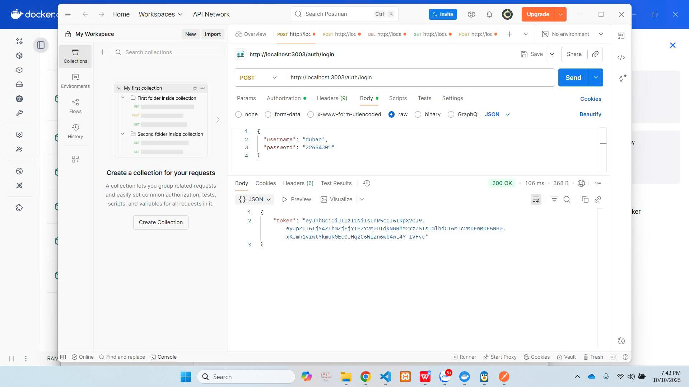
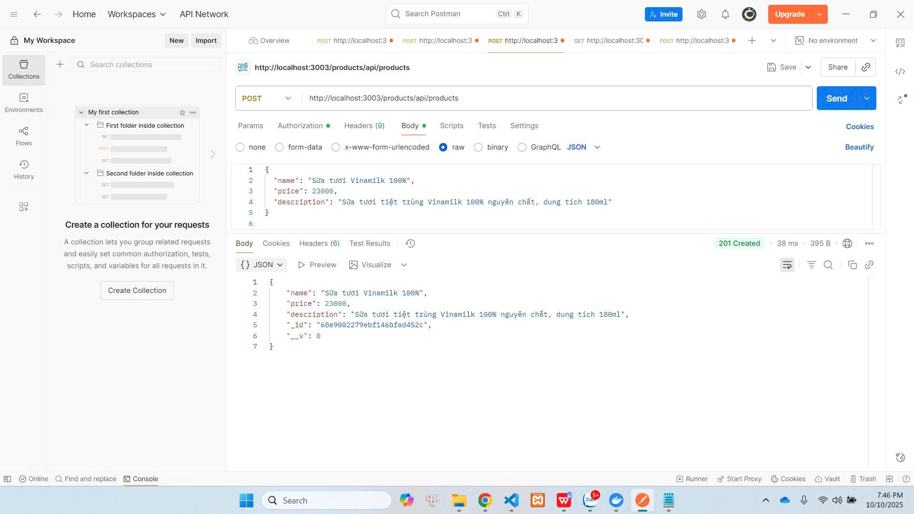
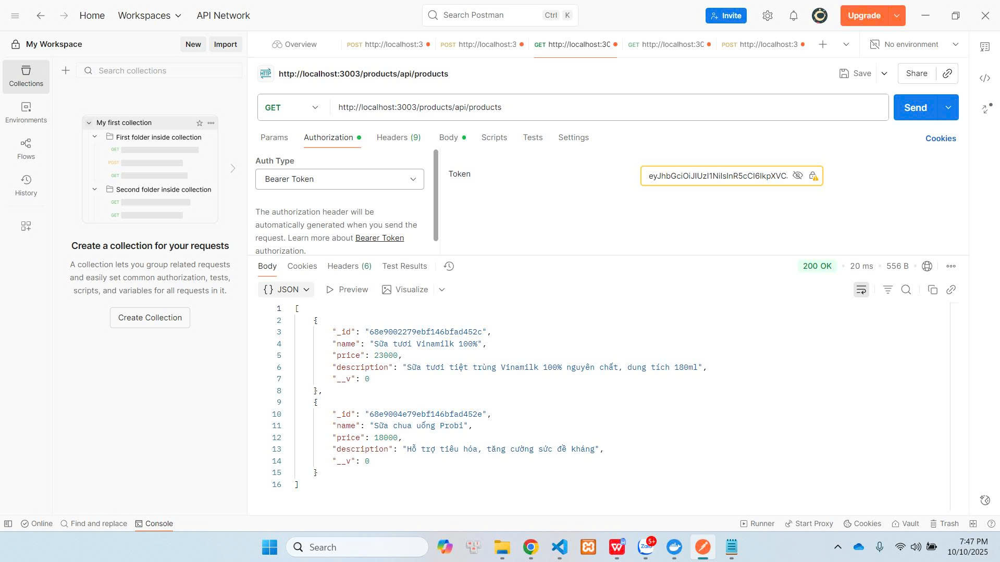
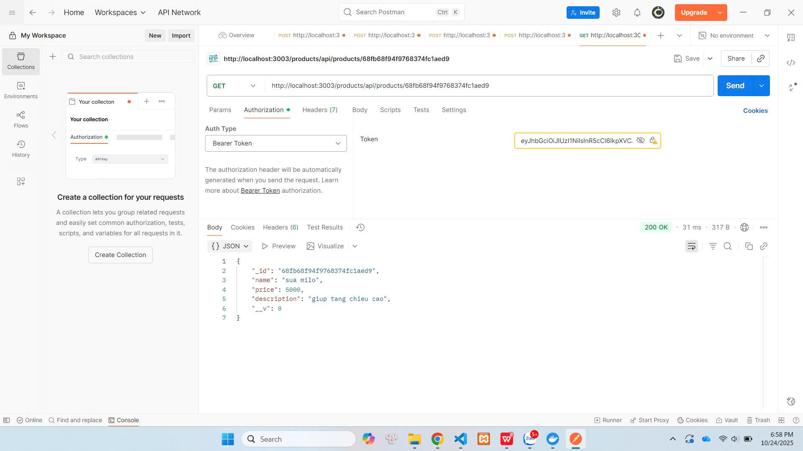
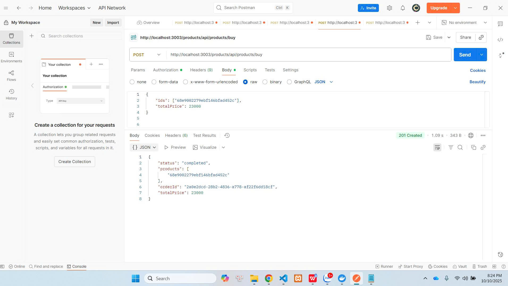
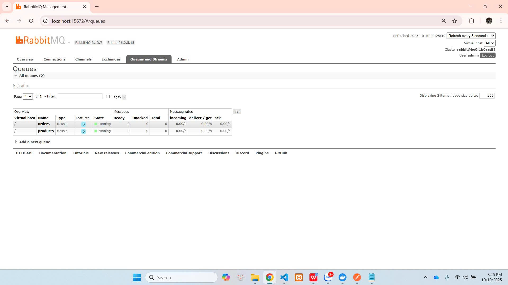

# 🧩 EProject Phase 1 - Microservices System

Dự án này được xây dựng bằng **Node.js**, **Express**, **MongoDB** và **RabbitMQ**, triển khai bằng **Docker Compose**.

---

## 🚀 Công nghệ sử dụng

| Công nghệ | Vai trò |
|------------|----------|
| **Node.js / Express** | Xây dựng các API cho từng dịch vụ |
| **MongoDB** | Lưu trữ dữ liệu người dùng, sản phẩm, đơn hàng |
| **RabbitMQ** | Truyền thông điệp giữa các dịch vụ |
| **Docker & Docker Compose** | Quản lý, khởi chạy và liên kết các container |

---

## Test all business logic with POSTMAN
###  Đăng ký người dùng

###  Đăng nhập người dùng

---

## Product Service

### Thêm sản phẩm

###  Lấy danh sách sản phẩm

###  Lấy sản phẩm theo ID

---

##  Order Service

###  Đặt hàng sản phẩm

---

##  RabbitMQ Service

Hệ thống sử dụng **RabbitMQ** để giao tiếp giữa các service (Pub/Sub model):

